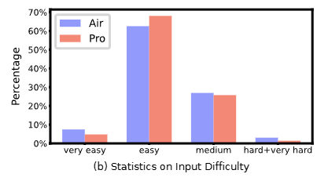
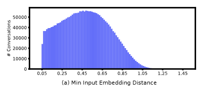

# Goal of the paper
Use existing instruct tuned models to generatea a large scale instruct tuning data set.

# Main points of research
Attempt to construct a dataset by prompting an instruct tuned llm with a pre query template

# Findings

## Dataset Coverage
- t-SNE plot of Magpie-pro encompasses area covered by plots of alpaca, evol instruct and ultrachat

## Dataset Attributes

### Task Categories
- \>1/2 pertain to information seeking
- Also includes creative writing, advice seeking, planning and math
- Magpie-pro (based on llam 70b) has a larger percentage of creative writing and a smaller percentage of planning compared to Magpire-air (based on llama 8b)

### Difficulty of instructions
- Rated with llama-3-8b
- Distributions accross both datasets are similar
- Text claims that magpie-pro has a larger percentage of harder questions, but the graph shows otherwise. Not too sure why.

### Instruction similarity
- Measured with minimum neighbour distance
- Seems to not be very diverse as the graph seems to peak around 0.5, with very few data points being above 1.0

### Quality of response
- This one feels weird as it basically just says that llama-3 instruct models produce answers of higher quality, which shows that they chose the right model

### Safety
- Using Llama-Guard-2 shows that less than 1% of data is potentially harmful
- Most unsafe resposes are due to offering specialised financial, medical or legal advice
- A very small percentage suggests non-violent crimes, and an even smaller percentage suggested violent or sexual crimes.

## Ablation analysis
- Increasing temperature and top-p values increase difficulty and diversity of the generated instructions, but it results in a drop in quality
- The default system prompt used with llama gives better results than appending a system prompt in the default settings (better average quality and higher difficulty on average)

## Performance analysis
- Win Rate (WR) and Length Controlled Win Rate (LC) both ranked higher than all other models fine-tuned with only SFT
- Outperforms even models that have undergone dpo
- manages to beat Llama-3-8b-Instruct in AlpacaEval 2
- Performance on reasoning tasks tends to degrade, and "booster' datasets containing math, code and reasoning instructions has to be used to get it closer to official models
