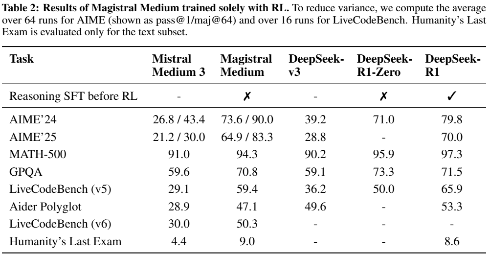
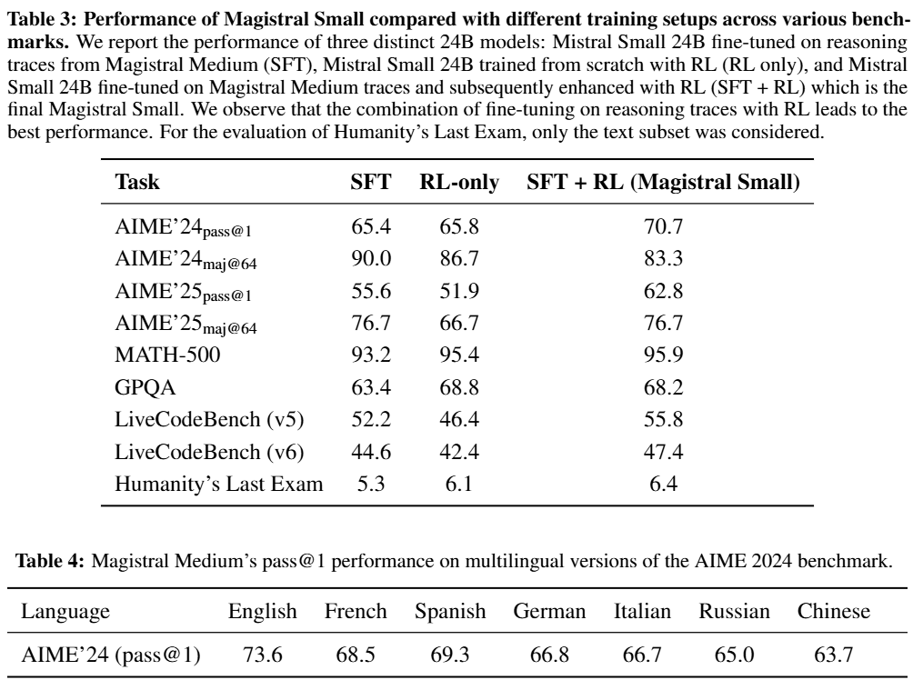
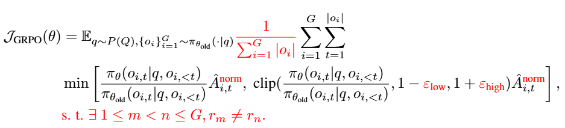
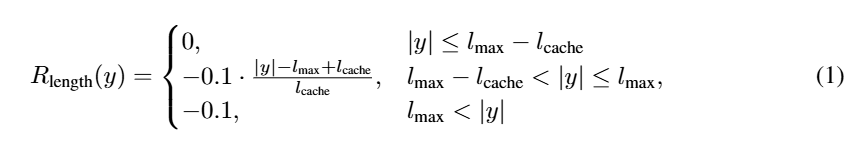
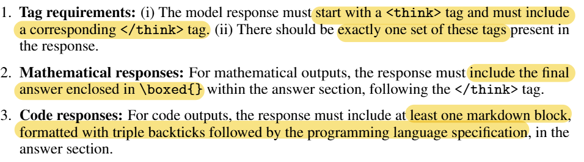

# Goal of the paper
Develop an RL stack to test and find out the limits of pure RL in LLM training

# Main Points of research
- Develop an RL framework with no distillation and train a model on it
- Add to existing RLVR literature

# Findings
## Benchmarks and Baselines
### Math benchmarks
- American Invitational Mathematics Examination (AIME)
- MATH dataset
### Coding benchmarks
- LiveCodeBench
- Aider Polyglot
### STEM benchmarks
- GPQA dataset  
###
Humanity's Last Exam was also used.  
Temperature was set to `0.7` for all tasks.  
Top-p of `1.0` was used for math and gpqa and `0.95` for coding tests  

## Magistral Medium
- Built without a cold start
- Training was done in multiple stages with distinct hyper-parameters
1. Dataset difficulty is increased with model performance
2. Maximum completion length and allowed completion length are increased.
3. Batch size and minibatch size are decreased

## Magistral Small
- "cold started" with SFT traces from Magistral Medium
### Cold start
- Diversity of prompts is important for the reasoning cold-start
- Data consists of traces with correct answers from RL of Magistral Medium
- Augmented by generated responses from Magistral Medium on a large set of from prompts from OpenThoughts and OpenR1
- 10% of datapoints for general instruction tuning also kept to preserve non-reasoning capabilities
- trained for 4 epochs with the best checkpoint chosen to start RL with
###
Substantial boosts can be gotten with RL even on the small model, which contradicts findings from DeepSeek-AI

## Multilingual benchmarks
- Performs 4.3-9.9% worse than English
- Similar degredation to base model
- Reasoning and final response performed in input language

## Results

## Ablations
### Cross Domain generalisation
- Training on only math or code leads to good improvements for the other
### Distillation vs RL on small models
- Pure RL leads to good performance boosts, even performing on par or better than the SFT model in some benchmarks
### Batch and minibatch size
- As long as $`n_{batch} = {n_minibatch}`$ and $`n_{batch}`$ is large enough, the performance does not change much
- If $`n_{minibatch}`$ is decreased while $`n_{batch}`$ is kept constant, performance degrades
### Advantage normalization
- Previous works have noted that normalization over a group can lead to bias
- Did not really affect performance in this study, so minibatch normalization was used

## Analysis
Increasing completion length is the main resource that improves model performance
### RL moves weights in low-dimensional space
- By using PCA analysis, they managed to create a 2 dimensional plot that shows that there is a direction in the weight space that corresponds to output length and reward
- The model continues to move in this direction until length limits are hit
### Multimodal improvements
- Models developed enhanced multimodal reasoning abilities in spite of only being trained on text only data
- Models transfer its extended thinking process across all types of questions
### Other capabilities
- RL has improved its tool calling and instruction following capabilities

## Unsuccessful approaches
### partial reward for code data
- Tried to give a proportional reward based on fraction of test cases passed
- Resulted in faster training but lower final performance
- Seems to provide false signal to incorrect solutions, leading to less meaningful training batfches
### Entropy targeting
- Adding an entropy bonus loss term was unstable as the effect of the entropy bonus varies significantly depenidng on the dataset
- For math only, and entropy bonus drops entropy, which discourages exploration
- For math and code datasets, it excessvely increases entropy
- It was more effective to depend on $`\epsilon_{high}`$ as it avoids instability issues
- Adding a KL term hinders training  

# Methodology
## RL algorithm
- Used Group Relative Policy Optimisation as it elliminates the need for a 'critic model'
- Functions by averageing rewards from multiple generations per prompt
### Changes to GRPO
- Eliminate KL divergence as in GRPO the policy will diverge regardless and removing helps to reduce compute cost
- Loss normalisation helps to avoid introducing length biases between generations in one group
- Advantage normalisation
- Relax the trust region's upper bound to increase entropy and diversity ion outputs
- Eliminate non diverse groups as they do not contribute to batch loss, but introduce additional noise

## Reward Shaping
### Formatting
- if the model does not fulfil the [required format](#formatting-requirement), it will be given a reward of 0, otherwise it gets a reward of 0.1 and proceeds to grading
### Correctness
- For math, the final answer is extracted and compared against the final answer
- Ground-truth and generated answers are normalised to reward sementaically identical responses
- Code written in cpp is compiled and 20 tests are randomly selected, with the same tests being given in to the same response group
For both cases, a correct answer, or one that passes all test cases will yield an additional reward of 0.9, resulting in a total of 1.0
### Length penalty
- Soft length penalties are used to signal to the model that the hard cutoff is near

### Multilingual language consistency
- 10% of the problems were translated to another language
- For the output, the components are normalized and then an additional reward of 0.1 is awarded if they're all the same language
### System prompt
- the [prompt](#system-prompt) `Be as casual and as long as you want` helps to increase entropy.

# Notes
## Formatting requirement

## System prompt
